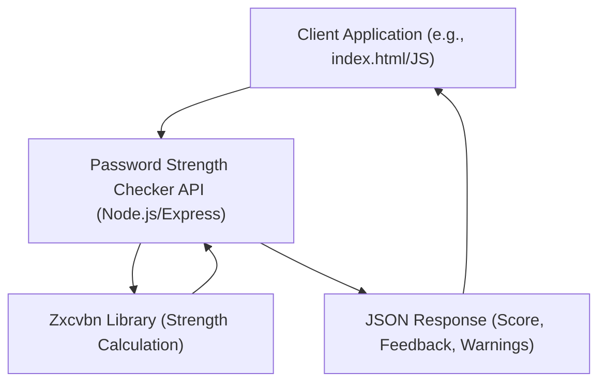

# Password Strength Checker API ✨

This project provides a robust and secure backend API for evaluating the strength of passwords. Leveraging the `zxcvbn` library, it offers comprehensive feedback, including a strength score, warnings, and suggestions, to help users create more secure passwords. A simple client-side HTML interface is also included to demonstrate the API's functionality.

## Table of Contents 📖

*   [Features ✨](#features-)
*   [Project Architecture 🏗️](#project-architecture-️)
*   [Tech Stack 🛠️](#tech-stack-️)
*   [Getting Started 🚀](#getting-started-)
    *   [Prerequisites](#prerequisites)
    *   [Installation (Local Development)](#installation-local-development)
    *   [Installation (Docker)](#installation-docker)
    *   [Running the Application](#running-the-application)
*   [API Endpoints 🌐](#api-endpoints-)
*   [Contributing Guidelines 🤝](#contributing-guidelines-)
*   [License 📄](#license-)
*   [Author 📧](#author-)

## Features ✨

*   **Comprehensive Strength Evaluation:** Utilizes the `zxcvbn` library, a sophisticated password strength estimator, to provide accurate and detailed assessments.
*   **Strength Scoring:** Assigns a numerical score (0-4) indicating the password's entropy and resistance to cracking.
*   **Detailed Feedback:** Offers specific warnings (e.g., "This is a common password") and actionable suggestions (e.g., "Add another word or two") to improve password strength.
*   **RESTful API:** Provides a clean and easy-to-integrate API endpoint for password strength checking.
*   **CORS Enabled:** Configured to allow cross-origin requests, facilitating integration with various frontend applications.
*   **Docker Support:** Includes a `Dockerfile` for easy containerization and deployment.
*   **Simple Client Example:** A basic `index.html` file demonstrates how to interact with the API from a web browser.

## Project Architecture 🏗️

The Password Strength Checker project follows a client-server architecture. The core of the project is a Node.js Express API that handles password strength evaluation requests.

### Architectural Overview

1.  **Client Application:** A simple HTML/JavaScript client (or any other frontend application) sends a `POST` request containing the password to be checked to the API endpoint.
2.  **API Server (Node.js/Express):**
    *   Receives the incoming `POST` request.
    *   Extracts the password from the request body.
    *   Passes the password to the `zxcvbn` library for strength calculation.
    *   Receives the detailed strength analysis (score, warnings, suggestions) from `zxcvbn`.
    *   Constructs a JSON response containing this analysis.
    *   Sends the JSON response back to the client.
3.  **Zxcvbn Library:** This is the core logic for password strength estimation. It analyzes the password against various patterns, common passwords, dictionary words, and entropy calculations to provide a comprehensive assessment.

### Architecture Diagram



## Tech Stack 🛠️

*   **Backend:**
    *   [Node.js](https://nodejs.org/): A JavaScript runtime built on Chrome's V8 JavaScript engine.
    *   [Express.js](https://expressjs.com/): A fast, unopinionated, minimalist web framework for Node.js.
    *   [zxcvbn](https://github.com/dropbox/zxcvbn): A realistic password strength estimator.
    *   [CORS](https://github.com/expressjs/cors): Node.js package for providing a Connect/Express middleware that can be used to enable CORS with various options.
    *   [dotenv](https://github.com/motdotla/dotenv): A zero-dependency module that loads environment variables from a `.env` file into `process.env`.
*   **Development Tools:**
    *   [Nodemon](https://nodemon.io/): A tool that helps develop Node.js based applications by automatically restarting the node application when file changes in the directory are detected.
*   **Containerization:**
    *   [Docker](https://www.docker.com/): A platform for developing, shipping, and running applications in containers.

## Getting Started 🚀

Follow these instructions to get a copy of the project up and running on your local machine for development and testing purposes.

### Prerequisites

Before you begin, ensure you have the following installed:

*   [Node.js](https://nodejs.org/en/download/) (LTS version recommended)
*   [npm](https://www.npmjs.com/get-npm) (comes with Node.js) or [Yarn](https://yarnpkg.com/getting-started/install)
*   [Git](https://git-scm.com/downloads)
*   [Docker](https://docs.docker.com/get-docker/) (if you plan to use Docker for deployment)

### Installation (Local Development)

1.  **Clone the repository:**
    ```bash
    git clone https://github.com/Can-Ozan/Password-Strength-Checker.git
    cd Password-Strength-Checker
    ```

2.  **Install dependencies:**
    ```bash
    npm install
    # or
    yarn install
    ```

3.  **Create a `.env` file:**
    Create a file named `.env` in the root directory of the project and add the following:
    ```
    PORT=3000
    ```
    You can change the port number if needed.

### Installation (Docker)

Docker provides a streamlined way to build and run the application in an isolated environment.

1.  **Clone the repository:**
    ```bash
    git clone https://github.com/Can-Ozan/Password-Strength-Checker.git
    cd Password-Strength-Checker
    ```

2.  **Build the Docker image:**
    This command builds a Docker image named `password-strength-checker` from the `Dockerfile` in the current directory.
    ```bash
    docker build -t password-strength-checker .
    ```
    *   `-t password-strength-checker`: Tags the image with the name `password-strength-checker`.
    *   `.`: Specifies that the Dockerfile is in the current directory.

3.  **Run the Docker container:**
    This command runs a new container based on the `password-strength-checker` image and maps port 3000 of your host to port 3000 inside the container.
    ```bash
    docker run -p 3000:3000 password-strength-checker
    ```
    *   `-p 3000:3000`: Maps host port 3000 to container port 3000. The API will be accessible on `http://localhost:3000`.
    *   `password-strength-checker`: The name of the Docker image to run.

    The API will now be running inside the Docker container and accessible via `http://localhost:3000`.

### Running the Application

#### Local Development

To start the server in development mode (with `nodemon` for auto-restarts):

```bash
npm run dev
# or
yarn dev
```

To start the server in production mode:

```bash
npm start
# or
yarn start
```

The API will be accessible at `http://localhost:3000`.

#### Docker

If you followed the Docker installation steps, the application is already running. You can verify its status using:

```bash
docker ps
```

You should see an entry for `password-strength-checker`.

#### Accessing the Client Example

Once the API server is running (either locally or via Docker), you can open the `index.html` file in your web browser to test the API.
Simply navigate to the `index.html` file in your project directory (e.g., `file:///path/to/Password-Strength-Checker/index.html`) or serve it via a simple static file server.

## API Endpoints 🌐

The API exposes a single endpoint for checking password strength.

### `POST /api/check-password`

Checks the strength of a given password and provides detailed feedback.

*   **URL:** `/api/check-password`
*   **Method:** `POST`
*   **Request Body:**
    The request body should be a JSON object containing the password to be checked.
    ```json
    {
        "password": "mySuperSecurePassword123!"
    }
    ```
*   **Response Body (Success - 200 OK):**
    A JSON object containing the password strength score, warnings, and suggestions.
    ```json
    {
        "score": 4,
        "feedback": {
            "warning": "",
            "suggestions": [
                "A strong password should be difficult to guess."
            ]
        },
        "guesses": 100000000000000000,
        "guesses_log10": 17,
        "crack_times_seconds": {
            "online_throttling_100_per_hour": 3600000000000000,
            "online_no_throttling_10_per_second": 3600000000000,
            "offline_slow_hashing_1e4_per_second": 360000000,
            "offline_fast_hashing_1e10_per_second": 360
        },
        "crack_times_display": {
            "online_throttling_100_per_hour": "forever",
            "online_no_throttling_10_per_second": "forever",
            "offline_slow_hashing_1e4_per_second": "11 years",
            "offline_fast_hashing_1e10_per_second": "6 minutes"
        },
        "sequence": [
            // Detailed sequence analysis from zxcvbn
        ]
    }
    ```
    *   `score`: An integer from 0 to 4, representing the password strength (0=very weak, 4=very strong).
    *   `feedback`: An object containing `warning` (a string message) and `suggestions` (an array of strings).
    *   Other fields (`guesses`, `crack_times_seconds`, `crack_times_display`, `sequence`) are directly from `zxcvbn` and provide more granular details about the password's strength and estimated cracking time.
*   **Response Body (Error - 400 Bad Request):**
    If the `password` field is missing from the request body.
    ```json
    {
        "error": "Password is required in the request body."
    }
    ```

## Contributing Guidelines 🤝

Contributions are welcome! If you have suggestions for improvements, new features, or bug fixes, please follow these steps:

1.  **Fork the repository:** Click the "Fork" button at the top right of the repository page.
2.  **Clone your forked repository:**
    ```bash
    git clone https://github.com/YOUR_USERNAME/Password-Strength-Checker.git
    cd Password-Strength-Checker
    ```
3.  **Create a new branch:**
    ```bash
    git checkout -b feature/your-feature-name
    # or
    git checkout -b bugfix/issue-description
    ```
4.  **Make your changes:** Implement your feature or fix the bug.
5.  **Commit your changes:** Write clear and concise commit messages.
    ```bash
    git commit -m "feat: Add new feature X"
    # or
    git commit -m "fix: Resolve bug Y"
    ```
6.  **Push your branch to your forked repository:**
    ```bash
    git push origin feature/your-feature-name
    ```
7.  **Open a Pull Request:** Go to the original repository on GitHub and click the "New Pull Request" button. Provide a detailed description of your changes.

Please ensure your code adheres to the existing style and includes relevant tests if applicable.

## License 📄

This project is licensed under the MIT License - see the [LICENSE](LICENSE) file for details.

## Author 📧

Yusuf Can Ozan
